# 🚀 Poetry Generator - Fine-Tuning et Évaluation des Modèles LLM

Bienvenue dans ce projet de **génération de poèmes** basé sur le **fine-tuning de modèles de langage**. Ce projet explore différentes architectures de modèles pour produire des poèmes de haute qualité à partir d'instructions données par l'utilisateur.

---

## 📌 Objectifs du projet

- **Fine-tuner plusieurs modèles de langage** pour la génération de poèmes.
- **Comparer les performances** des modèles en utilisant des métriques de qualité (BLEU, ROUGE, Cosine Similarity).
- **Sélectionner le meilleur modèle** en fonction des performances obtenues.
- **Développer une interface utilisateur interactive** permettant aux utilisateurs de générer des poèmes en entrant un titre, un thème et des instructions spécifiques.

---

## 🛠️ 1. Fine-Tuning et Évaluation des Modèles

Nous avons testé et comparé **quatre modèles de langage** pour la génération de poèmes :

1. **GPT-2** 
2. **LLaMA-3-8B** 
3. **Mistral 7B** 
4. **GPT-NeoX-20B**

📌 **Tous les notebooks de fine-tuning sont disponibles dans le dossier `notebooks/` du dépôt.**

### **🔍 Étapes du Fine-Tuning :**

1. **Préparation des données** : Sélection et prétraitement d’un dataset de poèmes (`checkai/instruction-poems`).
2. **Fine-tuning sur GPU** : Entraînement sur Google Colab et stockage sur Google Drive.
3. **Évaluation des performances** : Calcul des scores BLEU, ROUGE et Cosine Similarity.
4. **Comparaison des résultats** : Sélection du modèle le plus performant pour l'application finale.

#### **📊 Résultats de l’évaluation :**
## **1️⃣ Sur le dataset d'évaluation (que le modèle a vu durant l'entraînement) :** 

| Modèle | ROUGE-1 | ROUGE-2 | ROUGE-L | Cosine Similarity |
|--------|---------|---------|---------|------------------|
| GPT-2 Fine-Tuned | 0.8345 | 0.7342 | 0.8268 | 0.5457 |
| LLaMA-3-8B Fine-Tuned | 0.7895 | 0.6595 | 0.7802 | 0.6239 |
| GPT-NeoX-20B Fine-Tuned | 0.7002 | 0.4991 | 	0.6892 | 0.5245 |
| Mistral 7B Fine-Tuned | 0.7055 | 	0.5208 | 0.6934 | 0.6023 |

📌 **Analyse des résultats :**  
- **GPT-2 Fine-Tuned** affiche les meilleurs scores ROUGE, indiquant une forte correspondance avec les textes d'entraînement.  
- **LLaMA-3-8B Fine-Tuned** a la meilleure **similarité cosinus**, ce qui suggère qu'il capture mieux la structure sémantique globale.  
- **Mistral 7B et GPT-NeoX-20B** ont des performances légèrement inférieures mais restent compétitifs.

---

## **2️⃣ Sur le dataset de test (des données que le modèle n'a jamais vues) :** 

| Modèle | BLEU Score | ROUGE-1 | ROUGE-2 | ROUGE-L | Cosine Similarity |
|--------|-----------|---------|---------|---------|------------------|
| LLaMA-3-8B Fine-Tuned | 0.0138 |0.1531 | 0.0290 | 0.0970 | 0.1499 |
| GPT-NeoX-20B Fine-Tuned| 0.0167 | 0.1272 |  0.0332 |0.1024 | 0.1589|
| Mistral 7B Fine-Tuned | - | 0.0906 | 0.0178 | 0.0645 | 0.0866 |
| GPT-2 Fine-Tuned | errerurs lors du test|

📌 **Analyse des résultats :**  
- **GPT-NeoX-20B Fine-Tuned** affiche le meilleur **score BLEU** et **ROUGE-2**, indiquant qu'il est plus précis dans la génération de séquences cohérentes.  
- **LLaMA-3-8B Fine-Tuned** obtient le meilleur **ROUGE-1**, ce qui signifie qu'il capte bien les mots-clés des poèmes de référence.  
- **Mistral 7B Fine-Tuned** a des scores plus faibles, suggérant une moindre généralisation aux nouvelles données.


---

## 📷 Interface d'Évaluation

Nous avons développé une **interface intuitive avec Streamlit** pour permettre :

- La **génération de poèmes** basés sur un thème et des instructions spécifiques.
- L’**évaluation automatique des résultats** à l’aide de métriques NLP.
- L’**exportation des résultats** au format CSV.
- L’objectif principal de cette interface est d'évaluer et de comparer les modèles afin de sélectionner le plus performant.
- Dans la prochaine étape, nous développerons une application adaptée aux utilisateurs finaux, intégrant le modèle choisi.
  
Voici quelques images de notre interface ainsi que les résultats obtenus lors de nos tests des modèles.
### **1️⃣ Sélection du modèle et génération d'un poème**
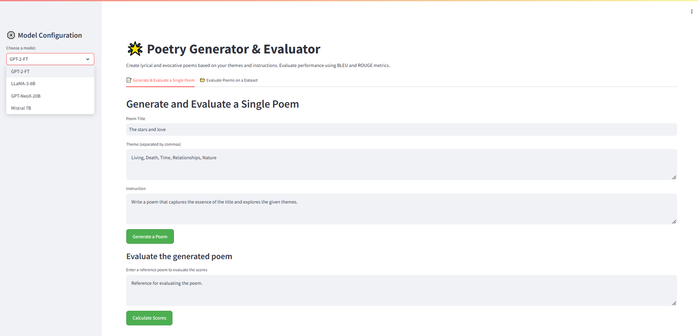

### **2️⃣ Sélection du modèle et génération de poèmes sur un ensemble de données (un dataset de plusieurs lignes)**
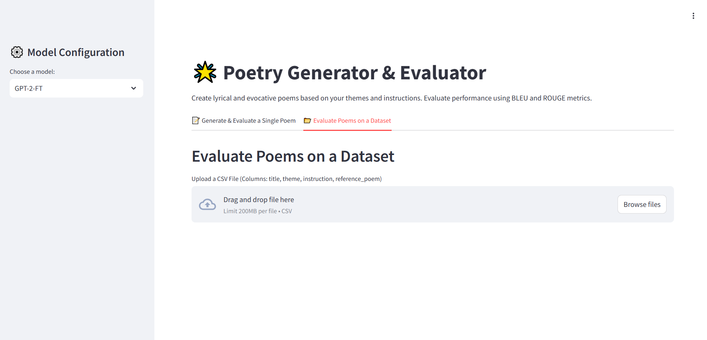

### **3️⃣ Poème généré avec Mistral 7B**
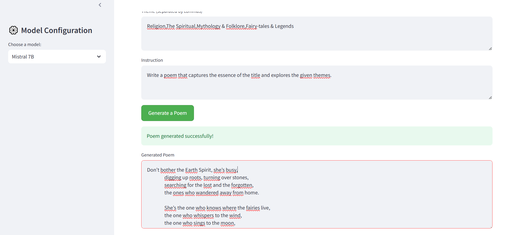
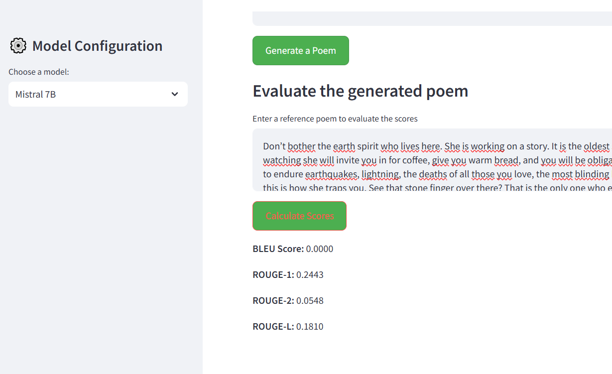

### **4️⃣ Poème généré avec LLaMA-3-8B**
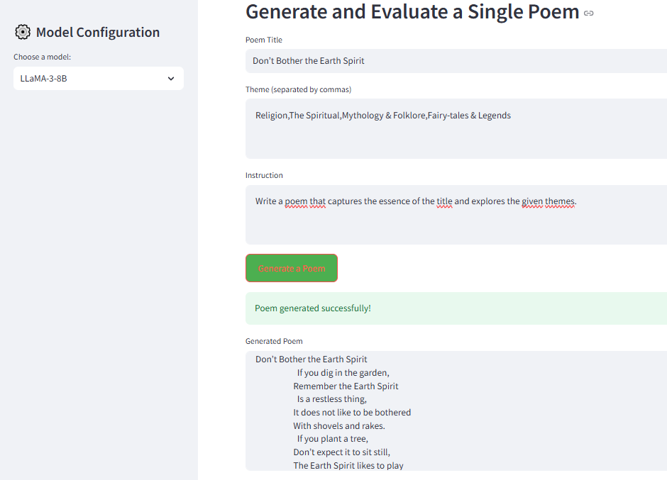
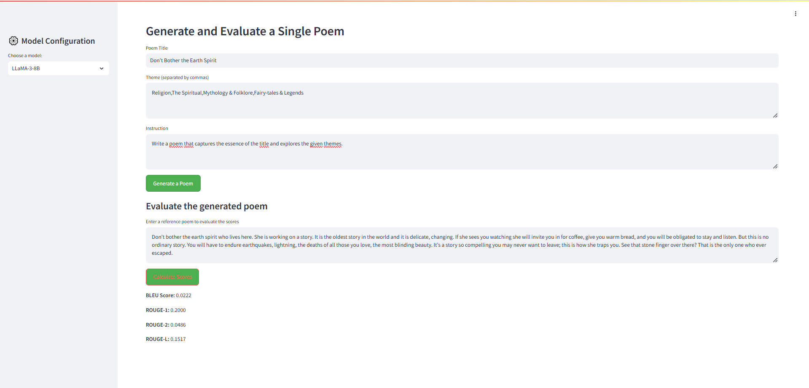

### **5️⃣ Poème généré avec GPT-2**
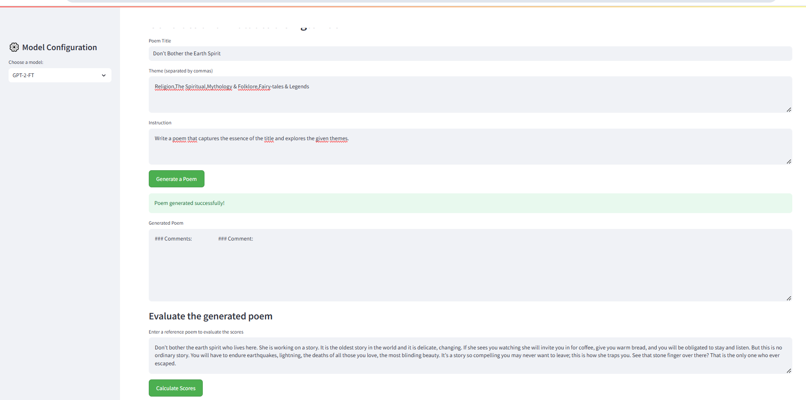

### **6️⃣ Évaluation des scores BLEU et ROUGE pour LLaMA-3-8B sur un petit dataset de 50 lignes**
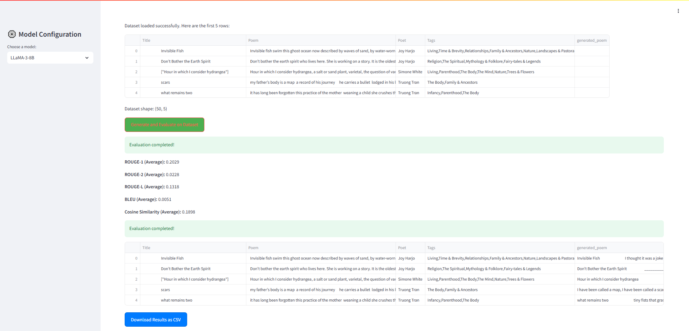
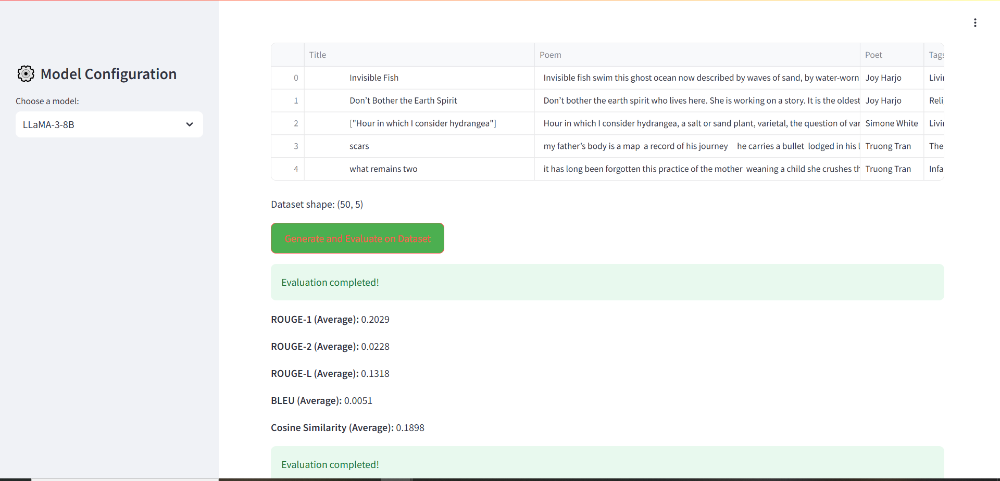

### **7️⃣ Évaluation des scores BLEU et ROUGE pour Mistral 7B sur un petit dataset de 50 lignes**
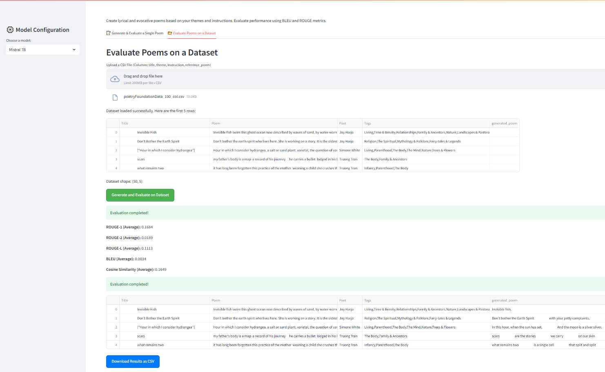
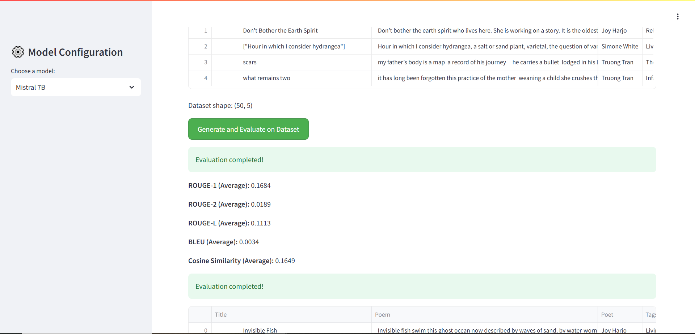

### **8️⃣  Évaluation des scores BLEU et ROUGE pour GPT-2 sur un petit dataset de 50 lignes**
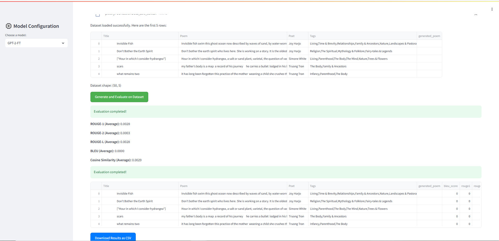
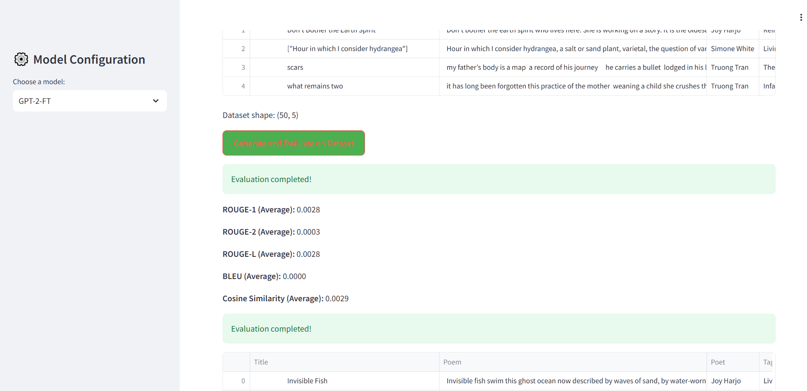

---

###**🎯 Sélection du modèle final** 

D'après les résultats obtenus dans les tableaux précédents, nous avons observé que les performances des modèles sont relativement proches, avec des résultats satisfaisants sur le dataset d'évaluation. Toutefois, sur le dataset de test, nous avons constaté une diminution des performances. **GPT-NeoX-20B** et **LLaMA-3-8B** se sont révélés être les plus performants. 

Après plusieurs tests via notre interface (comme illustré par les images ci-dessous), nous avons exclu **GPT-2**, car il ne générait pas de poèmes de manière cohérente. De plus, **GPT-NeoX-20B** posait des problèmes de mémoire, rendant son utilisation peu pratique. Finalement, le choix s'est fait entre **LLaMA-3-8B et Mistral 7B**, car ces deux modèles généraient des poèmes de qualité respectant bien les instructions et le format.

Voici un exemple des poèmes générés par ces deux modèles :

📌 **Poème généré par LLaMA-3-8B**

```
Don’t Bother the Earth Spirit
                      If you dig in the garden,
                    Remember the Earth Spirit
                      Is a restless thing,
                    It does not like to be bothered
                    With shovels and rakes.
                      If you plant a tree,
                    Don’t expect it to sit still,
                    The Earth Spirit likes to play
                    Hide-and-seek with its roots.
                      If you build a house,
                    Make sure it is deep,
                    The Earth Spirit likes to visit
                    And sometimes stay for a while.
                      If you walk in the woods,
                    Listen to the trees,
                    They will tell you where the Earth Spirit
                    Is hiding its treasures.
                      If you listen to the wind,
                    It will tell you where the Earth Spirit
                    Is going with its secrets.
                      If you follow the wind,
                    You will find the Earth Spirit
                    Dancing in the moonlight,
                    And if you follow the moon,
                    You will find the Earth Spirit
                    Singing its wild song.
                      Don’t bother the Earth Spirit.
```

📌 **Poème généré par Mistral 7B**

```
Don’t bother the Earth Spirit, she’s busy,
                digging up roots, turning over stones,
                searching for the lost and the forgotten,
                the ones who wandered away from home.

                She’s the one who knows where the fairies live,
                the one who whispers to the wind,
                the one who sings to the moon,
                the one who dances with the stars.

                She’s the one who weaves the dreams,
                the one who paints the sunsets,
                the one who holds the secrets,
                the one who keeps the mysteries.

                Don’t bother the Earth Spirit, she’s busy,
                digging up roots, turning over stones,
                searching for the lost and the forgotten,
                the ones who wandered.
```
📌 **Après comparaison des résultats et observation des poèmes générés, nous avons décidé de choisir **Mistral 7B Fine-Tuned** comme modèle final pour notre application.** 

✅ **Pourquoi Mistral 7B ?**  
- Il génère des poèmes plus fluides et artistiques, capturant mieux l'essence des thèmes donnés.  
- Il respecte bien les instructions et la structure des poèmes.  
- Il a une bonne gestion des prompts et une cohérence stylistique plus marquée.  
- Il est plus léger et moins gourmand en mémoire que LLaMA-3-8B, ce qui facilite son déploiement et son utilisation.  

  Ainsi, **Mistral 7B Fine-Tuned sera utilisé dans notre application finale** pour générer des poèmes en fonction des thèmes et des instructions de l’utilisateur. 🚀
---

## 🚀 2. Accès Public aux Modèles Fine-Tunés

🔗 **Les modèles fine-tunés sont hébergés sur Hugging Face et peuvent être téléchargés ici :**

- [LLaMA-3-8B Fine-Tuned](https://huggingface.co/IAyamina/llama3-8b_on_instruction_poems)
- [Mistral 7B Fine-Tuned](https://huggingface.co/IAyamina/mistral7b_on_instruction_poems)
- [GPT-2 Fine-Tuned](https://huggingface.co/IAyamina/gpt2_on_instruction_poems)
- [GPT-NeoX-20B Fine-Tuned](https://huggingface.co/IAyamina/gptneo20b_on_instruction_poems)

✅ **Solution :**

- Téléchargez le modèle directement depuis Hugging Face.
- Utilisez-le avec **Hugging Face Transformers** dans vos scripts Python.
- Exécutez les notebooks associés pour **réentraîner** le modèle et modifier les hyperparamètres si nécessaire.

💡 **Attention :**

- **Mistral 7B et LLaMA-3-8B nécessitent une clé d’accès**. Vous devez **demander l’accès** sur Hugging Face pour pouvoir les utiliser.

### **🔧 Étapes pour utiliser un modèle fine-tuné :**

1️⃣ **Chargez le modèle dans votre script Python :**

```python
from transformers import AutoModelForCausalLM, AutoTokenizer

model_name = "IAYamina/mistral7b_on_instruction_poems"  # Remplacez par le modèle souhaité
model = AutoModelForCausalLM.from_pretrained(model_name)
tokenizer = AutoTokenizer.from_pretrained(model_name)
```

2️⃣ **Générez un poème avec le modèle :**

```python
def generate_poem(prompt):
    inputs = tokenizer(prompt, return_tensors="pt")
    output = model.generate(**inputs, max_length=100)
    return tokenizer.decode(output[0], skip_special_tokens=True)

print(generate_poem("Un poème sur l'automne"))
```

**Si nécessaire, entraînez à nouveau le modèle avec les notebooks disponibles.**

---

## 🚀 3. Lancer l'Application et Tester les Poèmes

💡 **Attention :**
- Notre code est conçu pour être exécuté sur **Google Colab**.
- Vous devez **posséder une clé d'authentification pour `pyngrok`** si vous souhaitez déployer l'application de la même manière.
- Tous le code nécessaires à l'exécution se trouvent dans `app.py`.

### **🔧 Étapes pour lancer l'application :**


## 🚀 2. Lancer l'Application avec le Modèle Fine-Tuné

### **🔧 Étapes pour lancer l'application :**

1️⃣ **Charger le modèle depuis Hugging Face** en utilisant les identifiants des modèles fine-tunés :
```python
from transformers import AutoModelForCausalLM, AutoTokenizer

model_name = "IAyamina/mistral7b_on_instruction_poems"
model = AutoModelForCausalLM.from_pretrained(model_name)
tokenizer = AutoTokenizer.from_pretrained(model_name)
```

2️⃣ **Installer les dépendances nécessaires (`streamlit`, `pyngrok`, etc.)** et s'assurer de disposer d'un **GPU A100** pour une exécution optimale.

3️⃣ **Exécuter `app.py` et lancer l'application Streamlit :**
```bash
!streamlit run app.py --server.port 8501
```

📌 **Détails techniques :**
- Le fine-tuning a été effectué sur **Google Colab** en utilisant `transformers`, `torch` et `datasets`.
- Tous les modèles sont accessibles via Hugging Face.
- Une connexion Internet stable et un GPU puissant sont recommandés pour des performances optimales.


---

## 📌 Deuxième Étape :

✅ **Réalisation de l'Application Utilisateur**

Après avoir sélectionné le modèle le plus performant, l'étape suivante consiste à **développer une interface conviviale** permettant aux utilisateurs de générer des poèmes de manière interactive. Cette application offrira plusieurs fonctionnalités :

- Interface intuitive développée avec **Streamlit**.
- Génération instantanée de poèmes à partir d'un titre et d'instructions.
- Personnalisation du style et des thèmes de poèmes.
- Évaluation en temps réel des poèmes générés.

📌 **L'application sera hébergée en ligne pour une utilisation simplifiée par les utilisateurs.**


---


## 🔮 Perspectives et Améliorations

Pour améliorer les performances de notre modèle, plusieurs pistes d’amélioration sont envisagées :

- **Réentraînement sur un dataset plus large et diversifié** contenant des poèmes de différents styles afin d’augmenter la capacité du modèle à capturer diverses structures poétiques.
- **Application du Reinforcement Fine-Tuning** avec l’algorithme **PPO (Proximal Policy Optimization)** pour affiner encore davantage la qualité des poèmes générés et améliorer leur cohérence stylistique et sémantique.
- **Optimisation des paramètres du modèle** pour un meilleur compromis entre qualité des résultats et rapidité d’exécution.

Ces améliorations permettront d’obtenir un modèle plus performant et capable de générer des poèmes encore plus authentiques et personnalisés.

-----

## 🤝 Contribuer

Si vous souhaitez contribuer à ce projet :

1. **Forkez le dépôt**.
2. **Ajoutez vos améliorations** sur une nouvelle branche.
3. **Soumettez une Pull Request** avec une description détaillée de vos modifications.

N’hésitez pas à poser vos questions ou signaler des problèmes via la section **Issues** sur GitHub.

**🔗 Contact :** Pour toute question, contactez-moi directement via GitHub ou LinkedIn !

---

🔥 **Merci d’avoir suivi ce projet et bonne exploration de la génération de poésie avec l’IA !** 🔥

